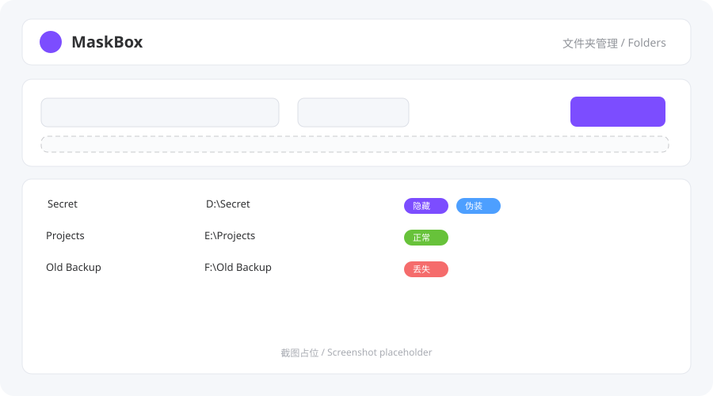
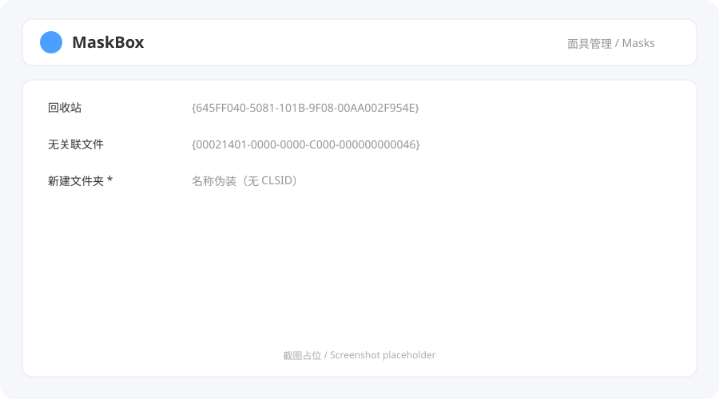

# MaskBox 面具盒

> **不只是隐藏，还能伪装 / Not just hide, but disguise**

MaskBox（原 HideTool）是一个仅面向 Windows 的本地文件夹管理工具：它可以像旧版一样用 `attrib +s +h` 隐藏文件夹，也可以给文件夹套上 Explorer CLSID「面具」——例如让它看起来像回收站、控制面板项，或任何你自定义的名称。

MaskBox (formerly HideTool) is a Windows-only, local-first folder toolbox. It hides folders with `attrib +s +h` and disguises them with Explorer CLSID masks — recycle bin, control-panel items, or a custom name of your choice.

[](https://github.com/ZPW2002/MaskBox/actions/workflows/ci.yml)
[](LICENSE)
[](https://github.com/ZPW2002/MaskBox/releases)
[](https://github.com/ZPW2002/MaskBox/releases)

---

## 预览 / Preview

> 截图占位：发布 v2.0.0 前用真实 UI 截图替换以下 SVG。




## 特性 / Features

- **不只是隐藏**：`attrib +s +h`，资源管理器中默认不可见
- **可自定义面具引擎**：内置 8 种 CLSID 面具，也可以新建「名称 + 可选 CLSID」自定义面具；CLSID 留空时退化为名称伪装（如伪装成「新建文件夹」）
- **完整 CRUD 与批量操作**：搜索、排序、多选批量隐藏/恢复/删除
- **拖拽添加**：从资源管理器把文件夹拖进窗口即可
- **丢失项提示**：数据库里的目标不见了会标红，可一键移除记录
- **中英双语**：默认跟随系统语言
- **本地优先**：所有路径只进本地 SQLite 与本地日志；无账号、无遥测、无云同步
- **绿色便携**：发布形态为 zip，解压即用；放入 `portable.txt` 后数据跟随程序目录

## 安装与使用 / Install & Usage

### 便携版 / Portable release

1. 到 [Releases](https://github.com/ZPW2002/MaskBox/releases) 下载 `MaskBox-vX.Y.Z-windows-portable.zip`
2. 解压后运行 `MaskBox.exe`
3. 可选：在程序目录新建空文件 `portable.txt`，数据将保存在程序目录而不是 `%APPDATA%\MaskBox\`

要求：Windows 10 1809+（使用系统自带的 WebView2 运行时）。

**v2.0.1（最新）**：

- 下载：[MaskBox-v2.0.1-windows-portable.zip](https://github.com/ZPW2002/MaskBox/releases/download/v2.0.1/MaskBox-v2.0.1-windows-portable.zip)
- SHA256：`6944374530c4eec06432642357b9def8a9ca9d85193730233379dd315db99c57`

> v2.0.0 曾因 PyInstaller 冻结后的前端资源路径错误显示 “Frontend not built”，已在 v2.0.1 修复并撤回旧 Release。

### 从源码运行 / From source

```bash
pip install -r requirements-dev.txt
cd frontend && npm install && npm run build && cd ..
python shell/main.py
```

headless 模式（不启动窗口，仅 API）：

```bash
python -m backend.app
```

### 校验下载文件 / Verify download

Release 页面附有 SHA256。PowerShell：

```powershell
Get-FileHash .\MaskBox-v2.0.1-windows-portable.zip -Algorithm SHA256
```

## 原理 / How it works

| 模式 | 原理 | 恢复方式 |
|------|------|----------|
| 隐藏 | `attrib +s +h`，给目录加上系统 + 隐藏属性 | 在 MaskBox 中「恢复显示」，或 `attrib "路径" -s -h` |
| CLSID 面具 | 把目录重命名为 `原名.{GUID}`，Explorer 会按命名空间对象渲染 | 删除记录或 `ren "原名.{GUID}" "原名"` |
| 名称面具 | 直接把目录重命名为自定义名称（如「新建文件夹」） | 在 MaskBox 中删除记录，或手动改回原名 |

MaskBox 数据库保存的是**原路径 + 面具引用**，不再保存拼接后的伪装路径，因此原文件夹名即使本身包含 `.{xxx}` 也不会被错误截断。

## FAQ

**Q: 伪装成回收站后，文件夹里的文件还在吗？**
A: 在。CLSID 伪装只改变 Explorer 如何渲染这个名字，文件内容不受影响。

**Q: 我误操作了，怎么恢复？**
A: 打开 MaskBox，删除对应记录即可自动改回原名并清除属性。如果程序无法启动，可手动执行：`attrib "伪装路径" -s -h`，再把名字中的 `.{GUID}` 后缀去掉。

**Q: 数据存在哪里？会不会上传？**
A: 默认 `%APPDATA%\MaskBox\data.db`；便携模式（程序目录有 `portable.txt`）存在程序目录 `data\data.db`。项目没有任何遥测，API 只绑定 `127.0.0.1`。

**Q: 这个工具能防住懂行的人吗？**
A: 不能。本工具定位是**防君子不防小人**，不做密码/加密。请勿用于保护敏感数据；误隐藏系统目录前，内置防呆也会拒绝。

**Q: 杀毒软件报毒？**
A: PyInstaller 打包的 Python 程序偶发误报。请从本仓库 Release 下载并核对 SHA256；如仍不放心，可直接从源码运行。

## 架构 / Architecture

```
backend/            # Python 引擎 + API（core 不 import Flask/webview）
  core/             #   领域逻辑：hide_service、mask_engine、guard
  storage/          #   SQLite 仓库、模型、数据目录策略
  api/              #   Flask v2 API，仅 127.0.0.1 + 随机端口
shell/              # pywebview 壳：窗口、原生目录选择、拖拽桥接
frontend/           # Vue3 + TypeScript + Vite + Element Plus
tests/              # pytest（Linux CI 可跑）
```

详细 Roadmap 见内部 guideline（每个编号任务对应一个 GitHub Issue 前缀）。

## 开发与贡献 / Contributing

见 [CONTRIBUTING.md](CONTRIBUTING.md)。提交信息使用 Conventional Commits。

## 许可证 / License

[MIT](LICENSE) © ZPW2002

---

> 免责声明：本工具仅用于管理你自己的文件夹。请勿在无权操作的设备上使用；因误操作导致的文件问题，使用者自行承担。It is a "keep honest people honest" tool, not a security product.
